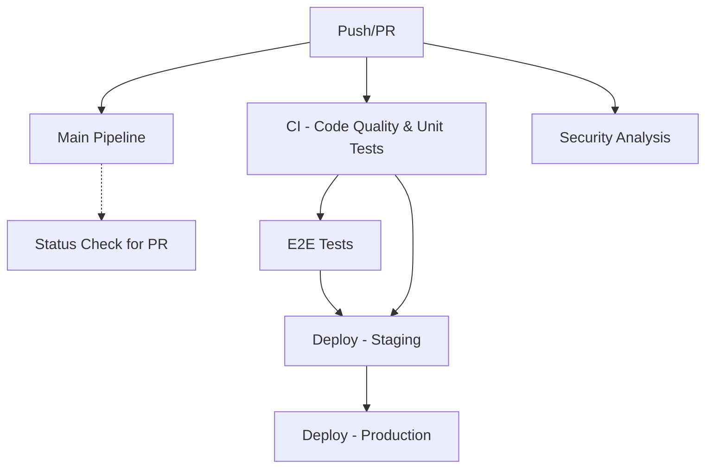

# GitHub Workflows Documentation

This project uses a modular GitHub Actions workflow structure for better organization, parallel execution, and easier maintenance.

## Workflow Structure

### 1. 🚀 Main Pipeline (`main.yml`)
**Triggers:** Push/PR to `main` or `develop` branches
- Coordinates all other workflows
- Provides status overview
- Acts as a status check for pull requests

### 2. 🧪 CI - Code Quality & Unit Tests (`ci.yml`)
**Triggers:** Push/PR to `main` or `develop` branches
- **Code Quality:**
  - ESLint for client and server
  - Prettier formatting checks
  - Security audits (npm audit)
- **Unit Tests:**
  - Angular unit tests (Karma/Jasmine)
  - NestJS unit tests (Jest)
  - Code coverage reporting to Codecov
- **Build:**
  - Angular production build
  - NestJS build
  - Artifact uploads for downstream workflows

### 3. 🔒 Security Analysis (`security.yml`)
**Triggers:** Push/PR to `main`/`develop`, Weekly schedule (Sundays 2 AM UTC)
- **Dependency Review:** License and vulnerability checks for PRs
- **CodeQL Analysis:** Static security analysis for TypeScript/JavaScript
- **Security Audit:** High-severity vulnerability scanning with reports

### 4. 🎭 E2E Tests (`e2e.yml`)
**Triggers:** Push/PR to `main`, After successful CI workflow
- **Full Stack Testing:**
  - Starts Docker services (PostgreSQL, Keycloak)
  - Runs NestJS server with real authentication
  - Runs Angular client
  - Server E2E tests with Keycloak integration
  - Cypress E2E tests with full user flows
- **Artifacts:**
  - Cypress screenshots (on failure)
  - Cypress videos (always)

### 5. 🚀 Deploy (`deploy.yml`)
**Triggers:** Push to `main`, After successful CI and E2E workflows
- **Staging Deployment:**
  - Docker image build and testing
  - Deployment to staging environment
- **Production Deployment:**
  - Manual approval required (GitHub environments)
  - Production deployment
  - Release tagging

## Workflow Dependencies



## Environment Setup

### Required Secrets
- `CODECOV_TOKEN`: For code coverage reporting
- `KEYCLOAK_CLIENT_SECRET`: For authentication testing

### Required Environments
- `staging`: For staging deployments
- `production`: For production deployments (with manual approval)

## Local E2E Testing

Use the provided test script for local e2e testing:

```bash
# Start all services for e2e testing
node test-e2e.js

# In another terminal, run Cypress tests
cd client
npm run test:e2e        # Interactive mode
npm run test:e2e:ci     # Headless mode
```

## Workflow Features

### ✅ Parallel Execution
- CI, Security, and E2E workflows run in parallel when possible
- Faster feedback for developers

### 🔄 Smart Triggering
- E2E tests only run after successful CI
- Deploy only runs after successful CI and E2E
- Security scans run on schedule for proactive monitoring

### 📊 Comprehensive Reporting
- Code coverage reports
- Security audit results
- E2E test artifacts (screenshots, videos)
- Build artifacts for deployment

### 🛡️ Security First
- Dependency vulnerability scanning
- License compliance checking
- Static code analysis with CodeQL
- Regular security audits

### 🚀 Production Ready
- Docker image building and testing
- Environment-specific deployments
- Manual approval gates for production
- Automatic release tagging

## Monitoring and Debugging

### Check Workflow Status
1. Go to the **Actions** tab in GitHub
2. Each workflow shows individual status
3. Click on any workflow for detailed logs

### Common Issues
- **E2E Tests Failing:** Check if all services started properly
- **Security Alerts:** Review dependency audit results
- **Build Failures:** Check linting and compilation errors

### Artifacts
- Build artifacts are available for 1 day
- Security audit results for 30 days
- Cypress videos/screenshots for default retention period

## Customization

### Adding New Workflows
1. Create new `.yml` file in `.github/workflows/`
2. Update this documentation
3. Add appropriate triggers and dependencies

### Modifying Existing Workflows
1. Test changes in a feature branch first
2. Update documentation if workflow behavior changes
3. Consider impact on dependent workflows

## Best Practices

### For Developers
- ✅ Ensure all CI checks pass before requesting review
- 🔍 Review security audit results
- 🧪 Run e2e tests locally when making significant changes
- 📝 Update tests when adding new features

### For Maintainers
- 🔄 Regularly review and update workflow dependencies
- 📊 Monitor workflow performance and optimize as needed
- 🛡️ Keep security scanning tools up to date
- 📋 Review and approve production deployments promptly 